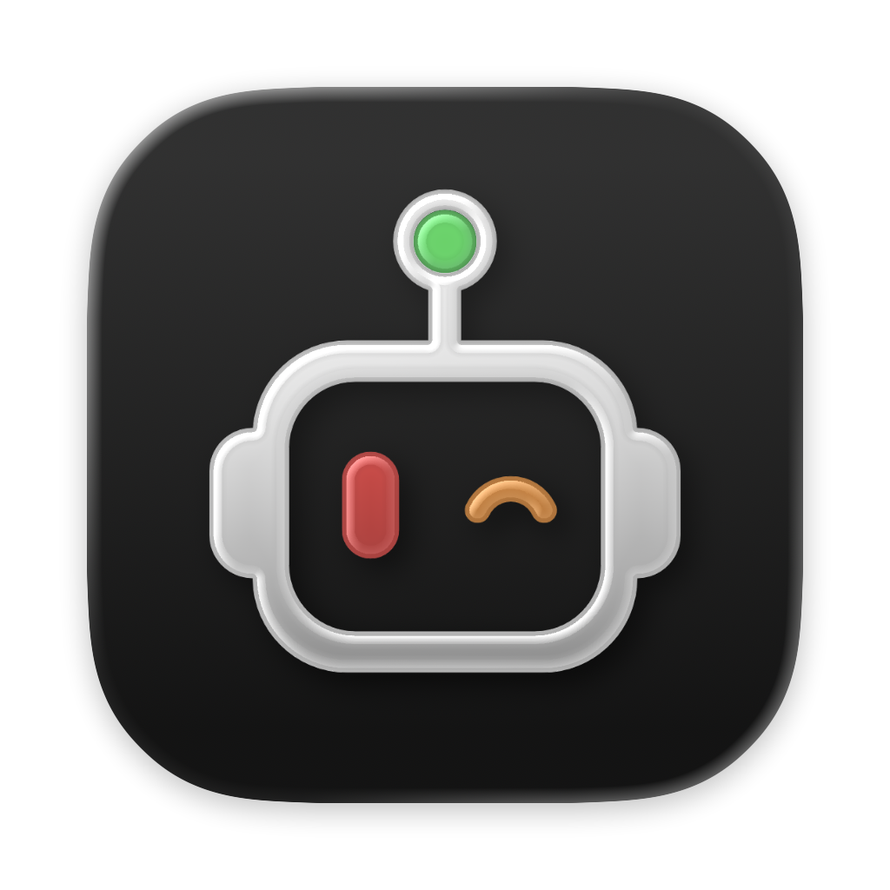
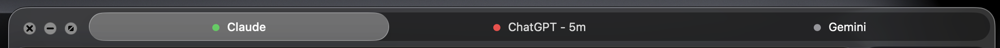
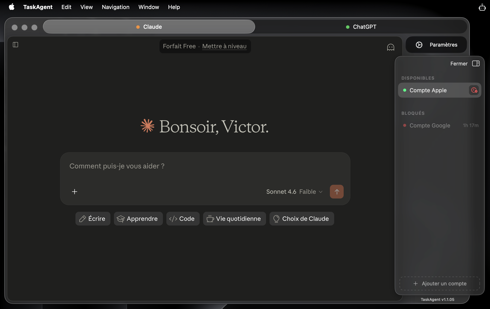
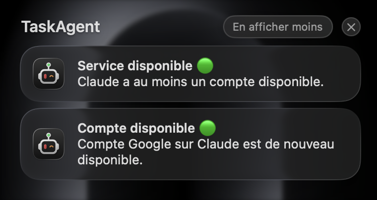
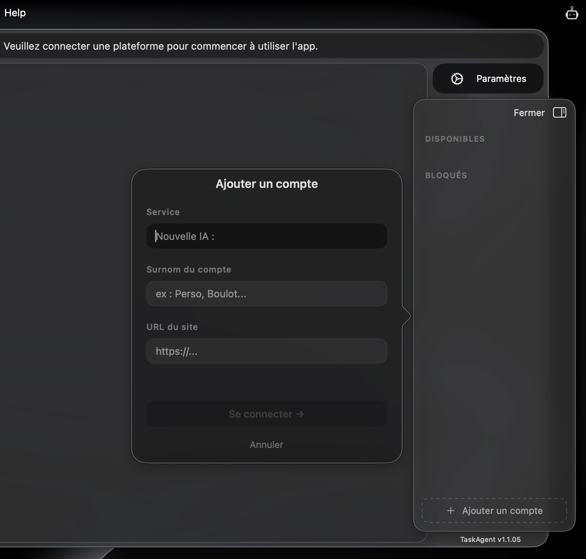
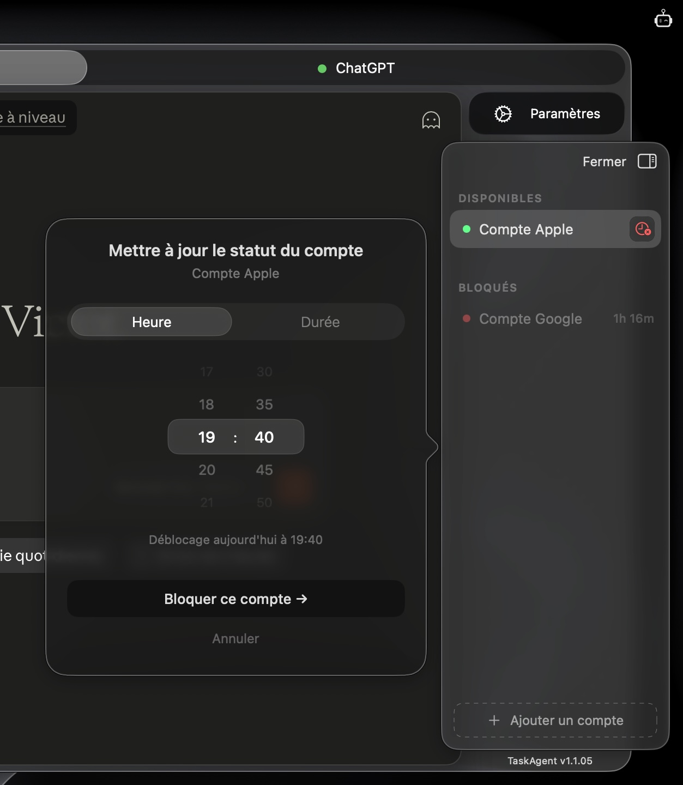

#  TaskAgent : Retrouvez toutes vos IA au même endroit

### 🎙️ Présentation rapide
TaskAgent est une application développée pour [MacOS (26.0 & ultérieur)](https://www.apple.com/os/macos/) permettant de gérer facilement tous les comptes dont vous disposez pour vous connectez à une ou plusieurs intelligence(s) artificielle(s).

---

# 🤖 Fonctionnalités

### ♾️ Connexion sans limites

Connectez tous les services d'IA que vous utilisez fréquemment (ex: [Claude](https://claude.ai/), [ChatGPT](https://chatgpt.com/), [Gemini](https://gemini.google.com/), et bien d'autres encore), puis retrouvez-les dans le panneau de gestion de l'application.

Vous y retrouverez tous les comptes ajoutés, ainsi que leur statut actuel :  
<table>
  <tr>
    <th>Pastille</th>
    <th>Statut</th>
    <th>Exemple</th>
  </tr>

  <tr>
    <td>🟢</td>
    <td>Disponible</td>
    <td rowspan="4" align="center">
      
    </td>
  </tr>

  <tr>
    <td>🟠</td>
    <td>Limité</td>
  </tr>

  <tr>
    <td>🔴</td>
    <td>Bloqué</td>
  </tr>

  <tr>
    <td>⚪️</td>
    <td>Inconnu</td>
  </tr>
</table>

### 🕵 Détection semi-autonome des limites d'usage
TaskAgent dispose d'un système de détection semi-autonome qui scanne régulièrement la page web intégrée, pour tenter de trouver une phrase correspondant à un blocage partiel ou total du compte concerné.  
Pour cela, rendez-vous :
1. Dans les paramètres de l'application (raccourci ⌘, )
2. Section *Détection*
3. Ajoutez librement autant de phrase-type à détecter.
> Note : Les phrases ne doivent pas contenir de date/heure. TaskAgent se charge de détecter lui même la durée si la limite en fait mention.

### ⌨️ Raccourcis clavier : pensés pour aller vite
L'application propose de multiples raccourcis clavier, permettant d'exécuter du bout des doigts toutes les tâches importantes :  
- ⌘ chiffre → Basculer d'une IA à une autre
- ⌘ ⌥ chiffre → Basculer d'un compte à un autre, au sein d'une même IA
-
- ⌘ : → Ouvrir/fermer le panneau flottant
- ⌘ R → Raffraîchir la page web intégrée
- ⌘ B → Ouvrir le menu *Blocage*
- ⌘ , → Ouvrir les paramètres de l'application

### 🔔 Notifications

<table>
  <tr>
    <td></td>
    <td align="left">
      TaskAgent peut vous envoyer des notifications lorsqu'un compte ou un service d'IA arrive au terme de sa durée de blocage. Cela vous permettra donc de travailler à nouveau sans perdre une minute.
    </td>
  </tr>
</table>

### 🔄 Proposition automatique des mises-à-jour au lancement de l'app

<table>
  <tr>
    <td></td>
    <td align="left">
      Grâce au dépot GitHub <a href="https://github.com/vico-coricoo/TaskAgent-updates"><i>updates</i></a>, TaskAgent est capable de détecter automatiquement toute nouvelle version en ligne et vous propose alors de la télécharger.
       
       
      Il sera nécessaire d'ouvrir le nouveau fichier <b><i>.dmg</i></b> et faire un cliquer-glisser de la nouvelle version dans le dossier <i>Applications</i>.  
Le système vous demandera si vous souhaitez remplacer l'ancienne version : <b>Cliquez sur <i>Remplacer</i></b>
    </td>
  </tr>
</table>

--------------------------------------------

### 🎨 Style de l'app
TaskAgent reprend le style moderne et épuré de MacOS Tahoe, avec de nombreux effets [*LiquidGlass*](https://www.youtube.com/watch?v=jGztGfRujSE).
L'application est conçue pour gagner du temps, grâce à son ergonomie et sa simplicité d'usage.

<table>
  <tr>
    <th>Page d'ajout de compte</th>
    <th>Page de blocage de compte</th>
  </tr>
  <tr>
    <td></td>
    <td></td>
  </tr>
</table>

### 📋 Listing dans la barre des menus

<table>
  <tr>
    <td></td>
    <td align="left">
      Le menu accessible depuis la barre supérieure de MacOS permet de consulter à n'importe quel moment l'état des différents comptes connectés.
       
      Cliqez sur un compte disponibles (pastille 🟢 ou 🟠) pour l'ouvrir directement dnas l'application TaskAgent.
    </td>
  </tr>
</table>
